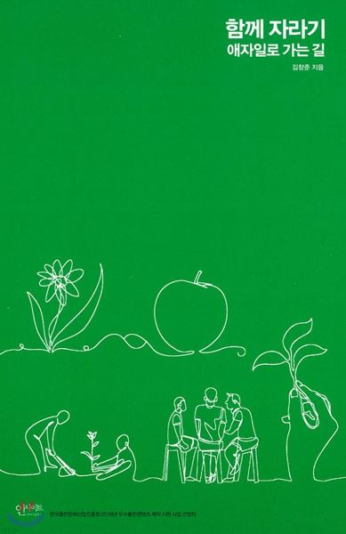

# 글을 시작하기에 앞서

 

블랙커피 블로그 스터디를 참여하게 되어 이 글을 쓰게 되었다. 
블로그 스터디에 참여하게 된 이유는 여러가지가 있지만, 가장 큰 이유로는 메이커준님이 주관하기 때문이라고 생각한다.
이전에 우연히 메이커준님의 독서 워크샵을 참여하게 되었는데, 메이커준님께서 소개해주셨던 SQ3R 기법등을 배우며 매우 인상깊었었다.
또한, 개발자로서 내가 학습했던 내용들을 잘 정리하여 불불 날리던 지식들을 한곳에 묶기 위한 이유도 존재한다.

이 블로그 스터디의 과정은 1주에 글 1편, 1달에는 글 3편을 작성하는 것이 목표이고, 자유 주제로 글쓴이가 주제를 선정하고 이를 공유하여 회고하는 과정이 존재한다. 
이 글 또한 이 스터디에 참여하는 과정의 일환으로, 만족스러운 글을 쓰려고 노력할 것이나 아직은 미숙하기 때문에 회고의 과정을 통해 많은 부분 수정될것 같다. 

**그래서 가벼운 마음으로 시작하고자 한다.**

 

## 선정한 책

 

앞서 언급했던 독서 워크샵에서 읽었던 함께 자라기 - 애자일로 가는길(김창준 지음)을 선정하였다.

 

나는 독서 워크샵을 참여하고 나서, 독서 워크샵이 단발성이란것을 알게 되었다. 
고가의 책은 아니지만, 그냥 두기에는 아까워서 출퇴근하면서 종종 읽었는데, 책의 내용도 좋았고, 단순히 기술적인 내용만 기술하는것이 아닌, 개발자로서 갖춰야하는 태도등을 산문 형식으로 기술하고 있어 언젠가 한번 정리해야될 필요성을 느끼고 있었다. 
이번 블로그 스터디를 통해 내가 읽으면서 느꼈던 점들을 정리할 것이다.

 

## 이 글의 목적

 

처음에는 기술 서적을 읽는것 처럼, 기술적인 부분들을 잘 정리해서 나중에 복습하는 용도로 사용하고자 개조식으로 글을 쓰고자 했었는데, 
갖춰야할 태도, 기술적인 부분등이 얽히고 얽혀있어 내 부족한 글쓰기 실력으론 잘 정리되지 않았고, 
이 책을 관통하는 하나의 글로 요약하고자 했지만 원할하지 않아 파트별로 나눠서 내가 느꼈던 점들을 다뤄 공유하고자 한다.

 

이 책은 크게 3가지 Part로 나뉘어져 있다.

- 개발자 본인 스스로 어떻게 실력을 향상시켜야 하는지를 다루는 '**자라기**'
- 다른 개발자와 협력하는 방안과 갖춰야할 태도를 다루는 '**함께**'
- 애자일 방법론을 성공적으로 도입하는 방법을 다루는 '**애자일**'

 

이 글에서는 이중 첫번째 파트인 '자라기' 파트에 대한 감상문을 쓰려고 한다.

---

# '자라기'

 

나는 개발자의 실력은 얼마나 많은 기술을 알고 있고 잘 이해하고 있는지, 해당 기술 스택을 사용한 경험, 도메인 지식과 설계 능력등으로 결정된다고 생각하고 있었다.
그래서 경력이 긴 개발자는 자연히 실력이 좋을 것이며, 내가 실력있는 개발자가 되기 위해선 꾸준하게 책을 사서 보고, 관련 강의를 들으며 기술에 대해서 학습하고, 계속해서 이 분야에 몸을 담궈 많은 경험을 해야 한다고 생각하고 있었다.

그래서 이 책을 처음에 접할 때는 사실은 개발자의 성장 부분을 다루는 '자라기'파트는 그다지 흥미가 가지 않았다. 
단순히 나에게 필요한 것은 절대적인 시간이라고 생각하며 요즘 진행하고 있는 프로젝트에서 협력이 원할하지 않아 얼른 '함께'파트를 읽고싶었다. 
이런 지루한 마음으로 책을 피고 첫 소챕터를 읽기 시작했는데, 초장부터 내 생각이 많은 부분 틀렸구나를 알게 되었다.

이 파트는 '경력'에 대한 내가 가지고 있던 편견을 지적하며 시작한다. 
경력은 일정 수준 이상의 실력을 갖춘 개발자들을 구분하기에는 적합한 지표가 아니라고 한다. 
이 문구는 나에게 **많은 양의 시간을 투자하여도 탁월한 개발자가 되기 힘들다**는 말처럼 들렸다. 
내 편견을 깨는 울림이 있는 말이었고, 그러면 어떻게 하면 탁월한 개발자가 될 수 있을까? 라는 궁금증이 들었다.

 

---

# 탁월한 개발자가 되기 위해서

 

탁월한 개발자가 되기 위해선 어떤 일을 해야한다고 말을 할까? 라는 궁금증으로 '자라기' 파트를 읽었다. 
내가 가지고 있었던 오해도 많았고, 어떤 태도로 실력 성장에 임할 지, 어떠한 전략을 취해야하는지 등 다양한 내용들이 수록되어있었다. 
내용들 하나 하나가 통계자료와 참조 자료등으로 디테일있게 수록되어 있었지만, 나에게는 크게 2가지 키워드로 와닿았다.

'**성장하기 위한 노력**', '**오해**'. 이 파트를 이 2가지 키워드로 정리하며, 앞으로 성장하고자하는 동기의 나침반으로 삼고자 한다.

 

## 성장하기 위한 노력

 

가장 궁금했었던 내용이었다. 실력을 향상시키기 위한 동기는 충분했으나, 어떠한 방향으로 이를 쏘아 내야할지 막막했던 나에게 방향성을 제시해준 내용들이다. 인상 깊었던 내용들을 요약하여 이 키워드를 정리하려한다.

 

### C 작업을 시도해라

> 자기개발의 효과를 보기 위해서 업무를 항상 개선하려는 작업(B 작업)을 시도해야하고, B작업을 개선하려는 작업(C 작업) 또한 계속해서 시도해야한다. 또한, C 작업을 수행하며 본인만의 툴도 만들어 정리해야 한다.
>

이 책에서는 자기개발이 복리로 돌아온다고 한다. 자기 개발한 내용을 **부트스트래핑**하여 앞으로 마주할 문제에 도움이 될 수 있도록 활용해야 한다고 한다. 학습했던 내용들을 지지고 볶아 도입하려 시도하고, 툴로 만들던지, 반영을 해보던지 하다보면 자연스럽게 복리로 돌아와 개발자의 성장에 도움이 된다는 말씀같았다.

지금 내가 맡고 있는 업무의 도메인이 매우 특이하고, 만약 이직을 한다면, 내가 했던 업무가 크게 도움이 되지 않을거란 생각에 따로 시간을 내어 공부하고 있었다. 
두가지 일을 병행해서 하려하니, 자연스럽게 업무의 집중도도 떨어지고 학습에 대한 흥미도 떨어지며, 복리는 커녕 단순 저축도 되지 않고  있었다.
'**C 작업을 시도해라**'라는 말은 노력의 방향성을 바로 잡게 도와준 문구였다. 
업무를 통해 성장하기 위한 또는 뒤에 기술할 난이도를 조절할 수 있는 툴들을 만들어야겠다는 다짐을 하게 되었다.

나는 리눅스 환경에서 Batch와 관련된 모듈들과 시스템의 개발을 맡고 있었는데, 단위 테스트로는 커버할 수 없는 경우가 부지기수 였고, 버그가 발생하면 디버깅에 에로사항이 꽃피고 있었다.
물론 툴을 개발할 생각은 하지도 않았고, 단순히 기록을 통해 나의 직관을 기르려고 노력했었다. 
이 점들을 반성하며, C 작업을 수행하기 위해 노력할 것이고 만약 툴을 개발한다면(하나는 무조건 만들것이다), 레퍼지토리에 업로드할 예정이다.

 

### 달인이 되는 비결

> 실력을 증진시키고자 하는 동기가 있어야하며, 적절한 시기에 피드백을 받아야한다. 양치질의 달인이 없는 이유를 생각해보라.
>

> 질 좋은 피드백에 본인을 노출하기 위해선, 변수를 제한하여 실험을 하면서 규칙성, 인과관계를 찾으려 노력해야한다. 즉, 스스로 또는 프로그램에서 피드백을 구할 수 있어야한다.
>

> 동료나 상사, 고객에게서 때로는 프로그램에서 피드백을 얻고자 노력해야한다.
>

이 파트의 전반적으로 등장하는 단어다. 
개발자의 실력을 증진 시키기 위해서는 '**동기**'가 있어야 하며, 결과물을 '**피드백**'을 적절한 시기에 받아야 올바른 방향으로 성장할 수 있다고 기술하고 있었다. 
동기 부여는 나에게는 차고 넘쳐 그냥 저냥 넘어갔지만, 피드백 부분이 매우 흥미로웠었다.

나는 피드백을 '더 나은 행동으로 나아가기 위해 결과를 평가하고 수정하는 행위'로 알고 있었다.
자연스럽게 '평가'에 초점이 맞춰져 있었고, 상급자로부터 피드백을 받는 경우만 생각하고 있었다. 
그러다보니 수동적으로 행동하며 만족하지 못하거나 납득이 되지 않는 피드백을 받았을 때 더러 입술이 삐죽 나왔었고, 자주 툴툴거렸다.

그런 나를 어떻게 알고 글쓴이분께서 매질을 하시는지, 피드백을 구하려고 얼마나 노력하는지 꼬집으며 **스스로 피드백을 하는 방법**을 친절히 알려주셨다. 
개발자의 성장 또는 **완전한 몰입은 해결하려는 문제의 어려움이 나의 실력과 비등비등할 때, 가장 효과적으로 이루어 진다고 한다.**

항상 완전히 몰입하려면 어떻게 해야할까? 
이를 위해선 업무 또는 학습하는 과정 중, 본인이 어떤 상태인지 인지하여야 한다고 한다. 
'**지루함**'을 느낀다면, 해당 업무는 실력에 비해 쉬운 업무를 맡고 있다는 뜻이며, 
'**불안함**'을 느낀다면 본인의 업무보다 어려운 일을 맡고 있다는 뜻이라고 한다. 
'지루함'과 '불안함'을 탈피하여 완전히 몰입할 수 있는 환경을 구성해야 한다고 책에서 기술하고 있다. 
만약 본인의 상태가 '지루함' 또는 '불안함'이라면 나와 같이 하기의 방법을 따라해보자.

 

---

**지루함을 느끼고 있다면**

업무의 난이도가 본인의 실력보다 낮은 상태이므로, 크게 2가지 방법을 취할 수 있다고 한다. 
'**난이도 높이기**', '**실력 낮추기'**가 그 정체다**.**

> **실력 낮추기**란, 원래 업무를 수행하던 환경 또는 사용하던 도구를 인위적으로 사용하지 않거나 컴파일을 자주하며 실행 결과를 확인했다면 이를 의도적으로 텀을 길게 두어 머릿속으로 생각하게끔 하는 것이다.

> **난이도 높이기**란, 본래 목표했던 요구사항보다 더 빡빡한 목표를 설정하거나 본래 업무와 상관없는자동화 테스트 추가, 리팩터링등을 수행하는것을 말한다.

 

**불안함을 느끼고 있다면**

업무의 난이도가 본인의 실력보다 높은 상태이미로, 동일하게 '**실력 높이기**', '**난이도 낮추기**' 2가지 방법을 취할 수 있다고 한다.

> **실력 높이기**란, 말 그대로 학습을 하는 방법등으로 실력을 높이는 방법이다. 하지만 지금 당장 불안함을 느끼고 있는 경우에는 적용되기 힘드므로 **사회적 접근**(나보다 뛰어난 전문가의 도움을 얻기), **도구적 접근**(내 능력을 확장시켜줄 수 있는 툴을 찾아 사용하기), **내관적 접근**(경험했던 비슷했던 상황을 되살려 과정을 되짚어보기)을 통해 실력을 단기적으로 높일 수 있다고 한다.

> **난이도 낮추기**란, 가장 간단하면서 핵심적인 결과물을 첫번째 목표로 삼는것으로 설명하고 있다.(애자일에서 말하는 WTSTTCPW) 테트리스를 만든다면, 도형 그리기를 첫번째 목표로 삼는것과 같다.

---

 

사실 이 4가지의 방법이 현실적으로 적용하기 힘든데, 그 이유는 우리가 만나게 되는 문제의 난이도는 위아래로 격변하기 때문이다. 
따라서 항상 자신이 어떤 상태인지 체크하고, 상기 4가지의 방법을 시기적절하게 이용해야한다고 이 책은 설명하고 있다.

 

## 오해

 

사실, 어떤 편견을 가질만큼 나는 경험이 다채롭지 않고, 경력 또한 길지 않다고 생각하고 있었다. 
하지만 나도 모르게 편견을 가지고 있었고, 이 편견들은 내 직장 생활에 꽤 다양한 방면으로 작용하고 있었다.(~~물론 안좋은 방향이다.~~)  항상 상기하고 실수를 범하지 않기 위해 정리해보자

 

### '경력'에 대한 오해

> ''경력'이 실력있는 개발자를 가리는 지표가 아니다.
>

이 글의 도입부에서 잠깐 기술했었던 내용이지만, 나를 반성하고자 다시한번 다루려고 한다. 
이 책에서는 '**경력**'은 경험이 적은 2~3년차의 개발자 내지는 대학 졸업자들의 실력을 구분하는데에는 유의미한 지표이지만, 그 이상의 경력을 가진 개발자들에게서는 무의미한 지표라고 말하고 있다. 
글쓴이 분의 경험으로, 또는 '상관성'이라는 개념을 통해 '경력'과 '생산성'의 상관 관계를 분석하며 설명해주고 있다.

뭐 그렇구나 하고 넘어갈 수 있었던 내용이지만, 나에게는 큰 울림이 있었던 말이었는데, 나는 자연스럽게 경력을 채우다 보면 실력이 향상될것이라고 생각했었기 때문이다. 
당연히 3년차보단 5년차가 더 잘하고, 5년차 보단 10년차 개발자분들이 잘할 것이라고 생각했었고,그렇기 때문에 업무에 집중하다 보면 실력이 자연스레 향상되겠지 라고 생각했었는데, 꼭 그렇지만은 않다고 책에 기술되어 있었다. 
상기 기술했었던 기술, 태도등을 유념하여 실력 향상을 위해 노력해야한다는 핵심이 이 오해로 설명하고 있다고 느꼈었다.

 

### '실수'에 대한 오해

> 실수는 예방하는것이 아닌, 관리하는 것이다.
>

이 책에서는 **실수를 예방하고자하는 단체**에서는 문제가 발생했을 때, **책임 소재**를 찾고, **비난**, **처벌**하며 그에 따라 실수를 숨기려고 하고, 협력이 조심스러워지며 **실수를 통해 학습을 할 수 없게 된다**고 한다. 
지금 속해있는 회사에 오기까지 군대를 비롯하여 여러 단체에 속해있었는데, 언제부터였는지는 모르겠지만, 업무 뿐만아니라 다양한 상황에서 실수를 예방하고자(비난을 피하고자) 다양한 문제 상황을 상상하고 해답법을 그려가며 임했었다. 
그러다보니 고려하지 못한 상황에 대한 대처가 더뎌지며 자책으로 이어지고, 그에 따라 의기소침하게 되는 달갑지 않은 경우가 더러 있었다. 
또한 실수한 사람을 책망하며 나름대로의 성장을 돕기위한 멘트랍시고 매콤한 말들을 던져 상처를 준 경험도 있었다. 
이 부분을 읽으며 어느 한편으로는 공감이 되지만, 어느 한편으로는 얼굴이 뜨거워졌었다.

이와 반대되는 단체로, **실수를 관리하고자 하는 단체**에서는 좋지 않은 결과가 도출되기 전에 실수를 공유하여 상황을 회복하도록 돕고, 이를 논의하며 실수를 통해 학습을 할 수 있게 된다고 한다.
때로는 실수를 격려하며 도움을 줘야한다고 하는데, 염세적인 나로서는 이러한 단체가 존재할 수 있을까? 라고 생각을 하는 한편, 나는 어떤 단체에 속해있는 걸까? 어떻게 실수를 관리하는 단체로 이관할 수 있게 할까?라는 질문을 스스로에게 던져보게 되었다.

앞선 질문들의 답은 아직까지는 '**모른다'** 이다. 하지만 글쓴이가 말하고자하는 바와 앞으로 지향해야될 점들을 알 순 있었다.
물론, 무턱대고 미래에 문제가 될 수 있는 상황을 고려하지 않고 설계를 진행하지는 않을 것이지만, 모든 상황을 고려해야하는 강박 관념에서 벗어날 수 있도록 노력하게되는 터닝포인트가 되지 않을까라는 정도로 정리하고자 한다.

 

### 뛰어난 개발자에 대한 오해

> 지식이 많은 개발자가 꼭 뛰어난 선생님은 아니다.
>

> 실력있는 개발자는 고독하지 않다. 오히려 사회적 자본(인맥, 동료간의 신뢰)과 기술(사회적 자본을 활용하는 기술, 협력)이 뛰어나며 이런 인터렉션하는 능력을 길러야한다.
>

영화나 드라마의 영향인지는 모르겠지만, 천재 개발자를 상상해보았을 때, 따라오는 이미지가 있었다. 
지저분한 책상, 널부러진 피자나 과자 부스러기, 사회성이 결여된 모습 등. 
알게 모르게 이러한 편견이 머리 한켠에 자리잡고 있었고, 나도 모르게 '**혼자서도 잘 할 수 있는 사람, 어떤 질문에도 척척 답하는 척척박사**'를 추구했었던것 같다. 
그러다보니 '이런 질문을 해도 되는건가?' 같은 어리석은 생각을 하기도하고 '최소한 이정도 노력은 해서 질문을 해야지' 같은 강박관념도 생겼다. 
그리고 나보다 뛰어난 개발자들에게 질문하여 답변을 들었을 때 이해를 하지 못해도 '내가 부족해서 잘 이해하지 못했구나'정도로 뭉게며 혼자 남아 공부를 하곤 했었다.

이 책에서 기술하는 '**뛰어난 개발자에 대한 오해**'는 나의 이러한 방식이 잘못되었다고 지적하는것 같았다. 
책에서는, 뛰어난 개발자는 고독과는 거리가 먼, 협업하는 사회적인 능력이 매우 뛰어남을 설명하고 있었다. 
예를 들어, 사전 지식이 없는 동일한 상황이 주어졌을 때, 뛰어난 개발자는 다른 동료에게 협업 능력을 이끌어 내어 일반적인 개발자들보다 빠르게 문제를 해결할 수 있다는 것이다. 
문제를 해결하기 위해서 끙끙대고 앓고있었던 나의 뒤통수를 한대 때려주는 내용이었다.

또한, 뛰어난 선생님은 인지적인 작업(내가 문제를 해결할 때 어떤 방식으로 접근했는지, 질문자의 상황에서는 어떤식으로 내 설명을 받아들일까 등)을 통해 가르침의 효과를 높인다고 한다. 
이 내용은 내가 질문을 해서 답변을 들었을 때, 이해하지 못한 이유들 중 하나가 될 수 있겠다라는 삼삼한 위안으로 삼을 수 있었다. (~~사실 글쓴이의 의도는 이것이 아니겠지만~~)

요약하자면, 뛰어난 개발자가 되기 위해서는 사회적인 능력을 기를 수 있도록 노력해야하며, 지식 공유를 원할히 진행하기 위해 인지적인 작업하는 버릇을 들여야된다고 요약할 수 있겠다.

---

# 글을 마치며

이 Part1을 내 나름대로 요약하기 위해 지하철에서 여러번 읽었었다. 
중학교 졸업 이후로 독후감을 써본적이 없었기 때문에, 생각했던 시간보다 훨씬 오래 걸렸었고, 생각한 만큼 문장이 잘 나오지 않아서 고생을 좀 했다.
글을 쓰기 전에 '글을 잘쓰는 법등을 공부했다면 더 좋은 글을 쓸 수 있었을 텐데'라는 아쉬운 생각이 들기도 했다. 
하지만 어쨌든 글 한편을 완성하며 그래도 하나 했다라는 보람이 느껴졌다. 
다만 걱정되는 부분은, 내가 느낀 바를 토대로 정리한 글이기 때문에, 이 책의 좋은 내용들이 온전히 전달되지 않았고, 오히려 오해를 불러일으킬 수 있겠다라는 걱정이 들었다.
그래서 이 책을 읽고자 하는 분들은 꼭 이 책을 읽어보기를 당부드리며 글을 마무리하겠다.